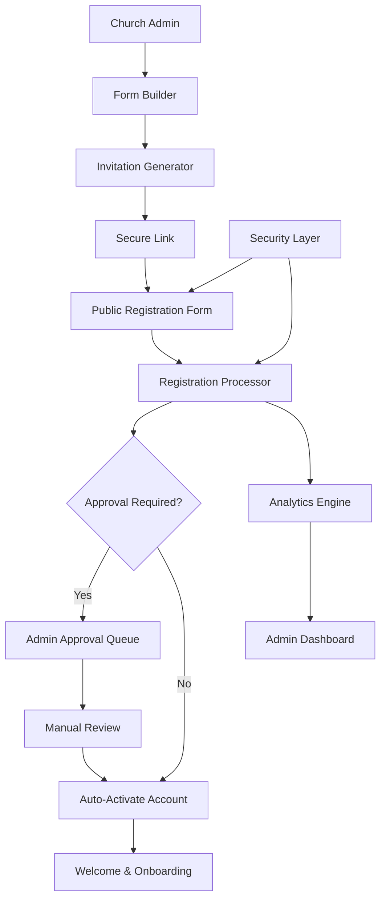

# Member Invitation System Design

## Overview

The Member Invitation System is a self-service registration platform that enables church administrators to create customizable invitation forms and generate secure, shareable links for potential members. This system eliminates the manual overhead of adding members individually while maintaining administrative control through configurable approval workflows.

The system consists of three main user flows:
1. **Admin Flow**: Form creation, link generation, and registration management
2. **Member Flow**: Self-registration through invitation links
3. **System Flow**: Automated processing, notifications, and security enforcement

## Architecture

### High-Level Architecture



### System Components

1. **Form Builder Service**: Dynamic form creation with custom fields and validation
2. **Invitation Manager**: Link generation, expiration, and usage tracking
3. **Registration Processor**: Form submission handling and user account creation
4. **Approval Workflow Engine**: Configurable approval processes
5. **Analytics Service**: Registration tracking and reporting
6. **Security Layer**: Rate limiting, CAPTCHA, and abuse prevention
7. **Notification Service**: Email confirmations and admin alerts

## Components and Interfaces

### Core Models

```typescript
interface InvitationForm {
  id: string;
  churchId: string;
  name: string;
  description?: string;
  fields: FormField[];
  branding: ChurchBranding;
  settings: FormSettings;
  createdBy: string;
  createdAt: Date;
  updatedAt: Date;
}

interface FormField {
  id: string;
  type: 'text' | 'email' | 'phone' | 'select' | 'checkbox' | 'date' | 'textarea';
  label: string;
  placeholder?: string;
  required: boolean;
  validation?: ValidationRule[];
  options?: string[]; // for select fields
  conditional?: ConditionalLogic;
}

interface InvitationLink {
  id: string;
  formId: string;
  churchId: string;
  token: string; // cryptographically secure
  maxUses?: number;
  currentUses: number;
  expiresAt?: Date;
  isActive: boolean;
  createdBy: string;
  createdAt: Date;
}

interface RegistrationSubmission {
  id: string;
  linkId: string;
  formId: string;
  churchId: string;
  formData: Record<string, any>;
  status: 'pending' | 'approved' | 'rejected';
  ipAddress: string;
  userAgent: string;
  submittedAt: Date;
  reviewedAt?: Date;
  reviewedBy?: string;
  rejectionReason?: string;
}
```

### API Interfaces

```typescript
// Admin APIs
POST /api/invitations/forms - Create invitation form
GET /api/invitations/forms - List church's forms
PUT /api/invitations/forms/:id - Update form
DELETE /api/invitations/forms/:id - Delete form

POST /api/invitations/links - Generate invitation link
GET /api/invitations/links - List active links
PUT /api/invitations/links/:id - Update link settings
DELETE /api/invitations/links/:id - Deactivate link

GET /api/invitations/submissions - List pending submissions
POST /api/invitations/submissions/:id/approve - Approve registration
POST /api/invitations/submissions/:id/reject - Reject registration

GET /api/invitations/analytics - Get registration analytics

// Public APIs
GET /api/public/invitations/:token - Get invitation form
POST /api/public/invitations/:token/submit - Submit registration
```

## Data Models

### Database Schema Extensions

```sql
-- Invitation Forms
CREATE TABLE invitation_forms (
  id VARCHAR PRIMARY KEY,
  church_id VARCHAR NOT NULL REFERENCES churches(id),
  name VARCHAR NOT NULL,
  description TEXT,
  fields JSONB NOT NULL,
  branding JSONB,
  settings JSONB,
  created_by VARCHAR NOT NULL REFERENCES users(id),
  created_at TIMESTAMP DEFAULT NOW(),
  updated_at TIMESTAMP DEFAULT NOW()
);

-- Invitation Links
CREATE TABLE invitation_links (
  id VARCHAR PRIMARY KEY,
  form_id VARCHAR NOT NULL REFERENCES invitation_forms(id),
  church_id VARCHAR NOT NULL REFERENCES churches(id),
  token VARCHAR UNIQUE NOT NULL,
  max_uses INTEGER,
  current_uses INTEGER DEFAULT 0,
  expires_at TIMESTAMP,
  is_active BOOLEAN DEFAULT true,
  created_by VARCHAR NOT NULL REFERENCES users(id),
  created_at TIMESTAMP DEFAULT NOW()
);

-- Registration Submissions
CREATE TABLE registration_submissions (
  id VARCHAR PRIMARY KEY,
  link_id VARCHAR NOT NULL REFERENCES invitation_links(id),
  form_id VARCHAR NOT NULL REFERENCES invitation_forms(id),
  church_id VARCHAR NOT NULL REFERENCES churches(id),
  form_data JSONB NOT NULL,
  status VARCHAR DEFAULT 'pending',
  ip_address INET,
  user_agent TEXT,
  submitted_at TIMESTAMP DEFAULT NOW(),
  reviewed_at TIMESTAMP,
  reviewed_by VARCHAR REFERENCES users(id),
  rejection_reason TEXT
);

-- Indexes
CREATE INDEX idx_invitation_forms_church ON invitation_forms(church_id);
CREATE INDEX idx_invitation_links_token ON invitation_links(token);
CREATE INDEX idx_invitation_links_church ON invitation_links(church_id);
CREATE INDEX idx_submissions_status ON registration_submissions(status);
CREATE INDEX idx_submissions_church ON registration_submissions(church_id);
```

### Form Field Configuration

```typescript
interface FormSettings {
  requireApproval: boolean;
  autoAssignRole: UserRole;
  autoAssignDepartment?: string;
  autoAssignBranch?: string;
  enableEmailVerification: boolean;
  enableCaptcha: boolean;
  allowDuplicateEmails: boolean;
  customSuccessMessage?: string;
  redirectUrl?: string;
  notificationEmails: string[];
}

interface ValidationRule {
  type: 'required' | 'email' | 'phone' | 'minLength' | 'maxLength' | 'pattern';
  value?: string | number;
  message: string;
}

interface ConditionalLogic {
  dependsOn: string; // field id
  condition: 'equals' | 'contains' | 'not_equals';
  value: string;
  action: 'show' | 'hide' | 'require';
}
```

## Correctness Properties

*A property is a characteristic or behavior that should hold true across all valid executions of a system-essentially, a formal statement about what the system should do. Properties serve as the bridge between human-readable specifications and machine-verifiable correctness guarantees.*

### Property Reflection

After analyzing all acceptance criteria, several properties can be consolidated to eliminate redundancy:

- Form configuration properties (1.2, 7.1, 7.2, 7.3) can be combined into comprehensive form validation properties
- Link generation and security properties (2.1, 8.1) address the same core requirement
- Notification properties (5.2, 6.2, 6.4) can be unified under communication consistency
- Approval workflow properties (5.1, 5.3, 5.4, 5.5) can be consolidated into workflow state management

### Core Properties

**Property 1: Form Configuration Consistency**
*For any* invitation form configuration with custom fields, validation rules, and branding settings, saving and retrieving the form should preserve all configuration data exactly as specified
**Validates: Requirements 1.2, 1.3, 7.1, 7.2, 7.3**

**Property 2: Form Preview Accuracy**
*For any* configured invitation form, the preview display should be identical to the public registration form in all visual and functional aspects
**Validates: Requirements 1.4, 1.5**

**Property 3: Secure Link Generation**
*For any* invitation form, generating an invitation link should produce a cryptographically secure, unique token that cannot be guessed or predicted
**Validates: Requirements 2.1, 8.1**

**Property 4: Link Access Control**
*For any* invitation link with expiration or usage limits, the system should enforce these constraints and prevent access when limits are exceeded
**Validates: Requirements 2.2, 2.4, 2.5, 8.5**

**Property 5: Public Form Accessibility**
*For any* active invitation link, accessing the link should display the correct registration form with proper branding, independent of admin authentication
**Validates: Requirements 2.3, 3.1**

**Property 6: Registration Processing Consistency**
*For any* valid form submission, the system should create a user account with correct church assignment, role assignment, and approval status based on form configuration
**Validates: Requirements 3.2, 3.4, 5.1, 5.5**

**Property 7: Form Validation Enforcement**
*For any* form submission with validation rules, the system should enforce all configured validation constraints and provide clear error messages for violations while preserving valid input data
**Validates: Requirements 3.3, 7.3, 7.4**

**Property 8: Conditional Field Logic**
*For any* form with conditional fields, the field visibility and requirements should change correctly based on user responses according to the configured conditional logic
**Validates: Requirements 7.4**

**Property 9: Registration Audit Trail**
*For any* registration submission, the system should create complete audit logs including timestamps, IP addresses, form data, and processing status
**Validates: Requirements 4.1, 8.3**

**Property 10: Analytics Accuracy**
*For any* set of registration data, the calculated analytics metrics (views, completions, success rates) should accurately reflect the actual registration events
**Validates: Requirements 4.2**

**Property 11: Duplicate Prevention**
*For any* registration attempt with duplicate email addresses (when duplicates are disabled), the system should prevent account creation and notify administrators
**Validates: Requirements 4.5**

**Property 12: Approval Workflow State Management**
*For any* registration requiring approval, the system should maintain correct approval status, send appropriate notifications, and process approval/rejection actions consistently
**Validates: Requirements 5.1, 5.2, 5.3, 5.4**

**Property 13: Communication Consistency**
*For any* registration event (submission, approval, activation), the system should send all configured notifications (emails, dashboard alerts) with accurate information
**Validates: Requirements 5.2, 6.2, 6.3, 6.4, 6.5**

**Property 14: Security Response Automation**
*For any* detected security violation or suspicious activity, the system should automatically implement protective measures (rate limiting, CAPTCHA, link deactivation) and alert administrators
**Validates: Requirements 8.2, 8.4**

## Error Handling

### Form Validation Errors
- **Invalid Field Configuration**: Prevent saving forms with invalid field types or conflicting validation rules
- **Missing Required Fields**: Ensure all required system fields (email, name) are included in forms
- **Circular Dependencies**: Detect and prevent circular conditional field dependencies

### Link Management Errors
- **Token Collision**: Handle rare cases of token generation conflicts with retry logic
- **Expired Link Access**: Graceful handling of expired link access with clear messaging
- **Usage Limit Exceeded**: Prevent registrations when link usage limits are reached

### Registration Processing Errors
- **Duplicate Email Handling**: Configurable behavior for duplicate email addresses
- **Church Assignment Failures**: Fallback handling when automatic church/branch assignment fails
- **Email Delivery Failures**: Retry logic and admin notifications for failed email delivery

### Security Error Handling
- **Rate Limit Violations**: Temporary blocking with exponential backoff
- **Suspicious Activity**: Automatic link deactivation and admin alerts
- **Data Validation Attacks**: Input sanitization and SQL injection prevention

## Testing Strategy

### Unit Testing Approach
The system will use comprehensive unit tests to verify:
- Form field validation logic with various input combinations
- Link generation and token security
- Registration processing workflows
- Email template rendering and delivery
- Analytics calculation accuracy

### Property-Based Testing Approach
Property-based tests will be implemented using **fast-check** (JavaScript/TypeScript property testing library) with a minimum of 100 iterations per test. Each property-based test will be tagged with comments referencing the specific correctness property from this design document using the format: `**Feature: member-invitation-system, Property {number}: {property_text}**`

Key property-based test areas:
- **Form Configuration**: Generate random form configurations and verify consistency
- **Link Security**: Test token generation uniqueness and security properties
- **Validation Logic**: Test form validation with random valid/invalid inputs
- **Workflow States**: Verify approval workflow state transitions
- **Analytics Calculations**: Test metric calculations with random registration data

### Integration Testing
- End-to-end registration flows from link generation to account activation
- Email delivery and notification systems
- Security measure activation under various threat scenarios
- Multi-church isolation and data segregation

### Security Testing
- Penetration testing of invitation links and registration endpoints
- Rate limiting and CAPTCHA effectiveness
- Input validation and sanitization verification
- Access control and authorization testing

## Implementation Considerations

### Performance Optimization
- **Database Indexing**: Proper indexes on frequently queried fields (church_id, token, status)
- **Caching Strategy**: Cache form configurations and church branding data
- **Async Processing**: Background processing for email delivery and analytics calculation
- **Rate Limiting**: Implement efficient rate limiting using Redis or similar

### Scalability Considerations
- **Horizontal Scaling**: Stateless design for easy horizontal scaling
- **Database Partitioning**: Consider partitioning large tables by church_id
- **CDN Integration**: Serve static form assets through CDN
- **Queue Management**: Use job queues for email delivery and background tasks

### Security Implementation
- **Token Generation**: Use cryptographically secure random number generation
- **Input Sanitization**: Comprehensive input validation and sanitization
- **HTTPS Enforcement**: All invitation links must use HTTPS
- **CSRF Protection**: Implement CSRF tokens for form submissions
- **Content Security Policy**: Strict CSP headers for form pages

### Monitoring and Observability
- **Registration Metrics**: Track registration success rates, form abandonment
- **Security Monitoring**: Alert on suspicious activity patterns
- **Performance Monitoring**: Track form load times and submission processing
- **Error Tracking**: Comprehensive error logging and alerting

### Data Privacy and Compliance
- **GDPR Compliance**: Support for data deletion and export requests
- **Data Retention**: Configurable retention policies for registration data
- **Consent Management**: Clear consent tracking and management
- **Audit Logging**: Comprehensive audit trails for compliance requirements